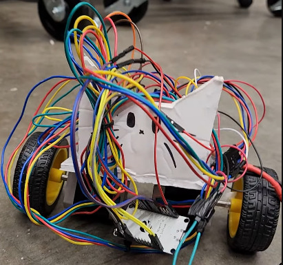
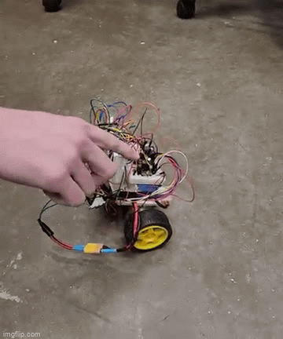

# GMUIIT's Balancing Robot ("C4")
This is a GMU IIT project to create a stable, remote-controllable and self-balancing robot that moves around using only two wheels.  

</img>
[</img>](https://youtube.com/shorts/UOZxaXaKwrk)

### Why?
We took up this project in hopes of learning several things:
 - How to design a real-time robot control loop, and real-time robot control algorithms
 - Balancing robot mechanical design (torque, speed, acceleration + center of balance)
 - Robust electrical system design in the face of large amounts of noise

### How?
The core concept of the code is actually quite simple:
 - At the beginning of each iteration of the main control loop, get the current yaw angle, calculated for us by the MPU6050.
 - Feed that angle into the PID controller, and get back our requested wheel speeds.
 - Use the requested wheel speed to set the frequency of steps delivered to the wheel steppers; if the wheel speed is negative, then the direction of the steppers is reversed.

 - In the background, we also listen for incoming BLE data, and dispatch it as necessary; PID tuning commands, resets, and other command types are all handled without disrupting the main loop.
